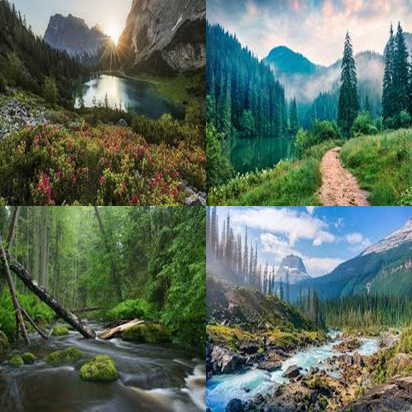

# Cloud Photo Intelligence Service

A report on AI usage, model workflows, manual vs automatic components

---

## 1. Overview

This service is designed to process photos in a cloud environment, extract metadata, perform intelligent analysis on the images, and store results in a database (via `database.py` / `metadata_model.py` / `routes/` etc). The folder structure shows:

* `ai/` — code for AI-driven image analysis
* `routes/` — HTTP endpoints or API layers
* `database.py`, `metadata_model.py` — data persistence & schema
* `main.py` — application entry point
* `config.py` — configuration
* `requirements.txt`, etc.

The main goal: *automatically* interpret images, generate intelligent metadata (e.g. caption and tags) and then persist that in a database, exposing a service for clients.

---

## 2. Where and How AI Was Used

### Location

* The AI logic resides in the `ai/` folder.
* Within `ai/`, there are modules that accept image inputs and run a local model and external APIs to analyse.
* The rest of the system (routes, database, metadata_model) handle orchestration, data storage, endpoints, etc.

### Nature of AI Use

* The service uses "gemini-2.5-flash" to generate caption and tags for each image.
* The generated caption and tags are then used in metadata generation. 
* A local model (clip-ViT-B-32) is then used for embedding the images into semantically rich vectors and storing them in qdrant database.

---

## 3. Prompts and Model Inputs

Since this repository uses either a pre-trained vision model or API, the inputs are:

* **Input**: photo/image file 
* **Prompt/Request**: The API uses the prompt below for caption and tag generation. No prompt is needed for embedding model.

  > "Generate a short caption and at least 5 tags for this image."


**Model Outputs**: The API generates caption and at least 5 tags for each image. The embedding model generates a vector of size 512 to represent each image.

API call:

```python
response = client.models.generate_content(
    model=GEMINI_MODEL,
    contents=[file, "Generate a short caption and at least 5 tags for this image."],
    config=config,
)
```

Embedding model call:

```python
embedding = model.encode(image).tolist()
```

Generated caption and tags are then inserted into an pre-initialized metadata and save into "data/metadata".

---

## 4. How Model Outputs Were Refined

Since a predefined config is used for caption and tag generation there is no need for furthur refinement. The caption and tags can simply be extracted:

```python
schema = types.Schema(
    type=types.Type.OBJECT,
    properties={
        "caption": types.Schema(
            type=types.Type.STRING,
        ),
        "tags": types.Schema(
            type=types.Type.ARRAY,
            items=types.Schema(type=types.Type.STRING),
        )
    },
    required=["caption", "tags"]
)

config = types.GenerateContentConfig(
    response_mime_type="application/json",
    response_schema=schema
)
```
There is an extra step for making moodboards. The outputs are resized so we can make a collage of them (you can see the code in moodboard.py)


---

## 5. Manual vs AI-Generated Parts

### AI-Generated

* Caption and tag generation
* Embedding images
* Embedding search queries

### Manual 

* Storing vectors and metadata.
* Searching process (via qdrant database which uses cosine similarity).
* The API endpoints, database schema, routing, configuration are manual.
* Postprocessing of output for generating moodboard.

### How they interact

* When a photo arrives it is temporarily saved in "data/upload" folder and a background task starts to generate caption and tags for that photo to save the metadata. 
* Then the embedding model generates a representong vector and saves it in qdrant dataset. 
* When the user wants to get the photo, the app looks into "data/metadata" to find the metadata of the image with that photo id and returns the metadata as a json file.
* When user wants to search or make a moodboard, first the embedding model vectorizes the query. Then qdrant returns the matching points in dataset. 

---

## 6. Output Samples

Input :


Generated caption : `A serene path winds through a misty forest alongside a tranquil lake, with mountains shrouded in fog.`

Tags : `nature`, `landscape`, `forest`, `mountains`, `lake`, `path`, `mist`,`trees`, `serene`,`outdoor`

Moodboard query : `nature`

Generated moodboard:

